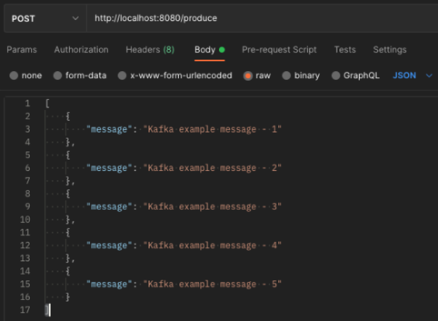
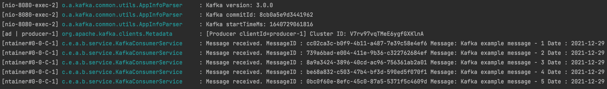

### Spring For Kafka Basic Example

This repository includes basic implementation and usage of Kafka in Spring Boot.

Implementation details : https://medium.com/@aliarslan10/apache-kafka-configuration-in-spring-boot-with-producer-and-consumer-example-621adf2fd78b

More details about Spring for Kafka : https://docs.spring.io/spring-kafka/reference/html/

### Install and Run Kafka

Go to `src/main/resources` and run command down below.

```
docker-compose up
```

docker-compose file will pull and start Kafka by using docker-kafka images of Spotify.

spotify/docker-kafka repository : https://github.com/spotify/docker-kafka

### Producing Message Over Rest API



### Consuming Message Over KafkaListener



### License

This project is licensed under the MIT License.

### Author

[Ali Arslan](https://www.linkedin.com/in/aliarslan10)
